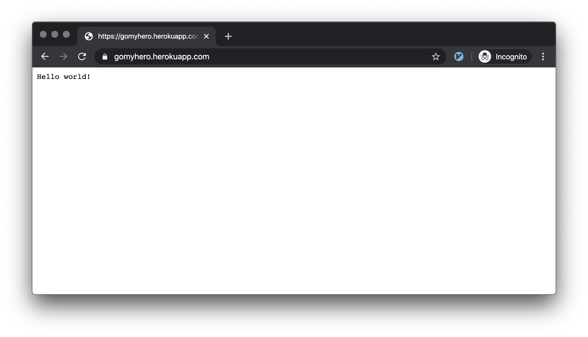

# Docker + Go + Heroku
## Development Stage
1. Example of Go code

```go
// main.go
package main
import (
	"io"
	"log"
	"net/http"
	"os"
)
func hello(w http.ResponseWriter, r *http.Request) {
	io.WriteString(w, "HELLO WORLD")
}
func main() {
	http.HandleFunc("/", hello)
	port := os.Getenv("PORT") // Heroku provides the port to bind to
	if port == "" {
		port = "8080"
	}
	log.Fatal(http.ListenAndServe(":"+port, nil))
}
```

2. Example of Dockerfile
```dockerfile
# build stage
FROM golang:alpine AS build-env
ADD . /src
RUN cd /src && go build -o goapp

# final stage
FROM alpine
WORKDIR /app
COPY --from=build-env /src/goapp /app/
CMD ./goapp
```

3. Build container and run it
```bash
docker build -t research/go-heroku .
docker run --rm -it -p 8080:8080 research/go-heroku
```
go see http://localhost:8080

## Heroku Deployment Stage
```bash
# 1. Make sure you have heroku-cli and run this command 
heroku container:login

# 2. Create heroku app
heroku create ${HEROKU_APP_NAME} 

# 3. Push the container to heroku app
heroku container:push web --app ${HEROKU_APP_NAME}

# 4. Release the image to the app
heroku container:release web --app ${HEROKU_APP_NAME}	

# 5. (Optional) Open the app
heroku open --app ${HEROKU_APP_NAME}
```

## Example of Running App on Heroku


## Adding Heroku.yml
```yaml
build:
  docker:
    web: Dockerfile
```

```
git add .
git commit 
git push heroku master
```

## TODO
- [ ] Using CI

## References
- [How to Run Dockerized Apps on Heroku… and it’s pretty sweet](https://medium.com/travis-on-docker/how-to-run-dockerized-apps-on-heroku-and-its-pretty-great-76e07e610e22)
- [Building Docker Images with heroku.yml Is Generally Available | Heroku](https://blog.heroku.com/build-docker-images-heroku-yml)


